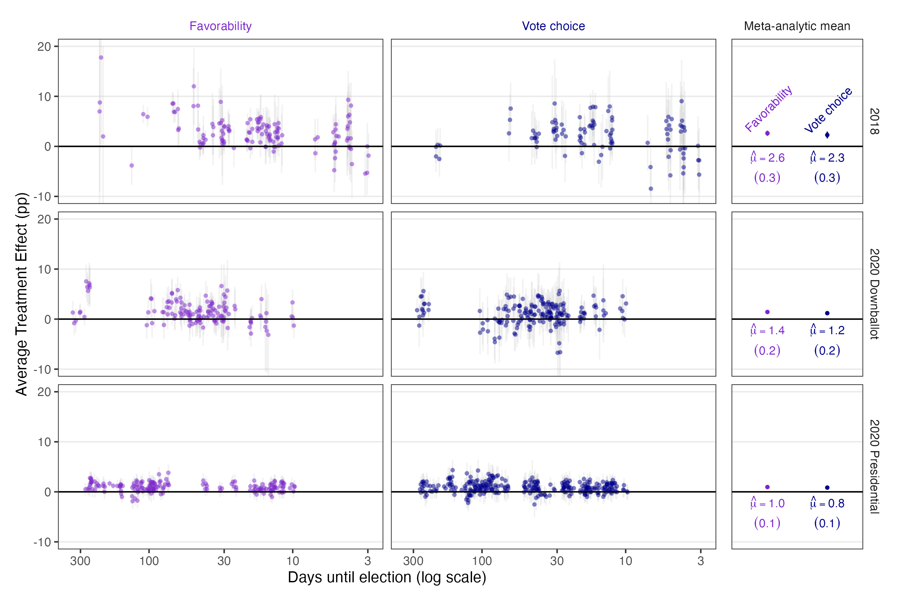
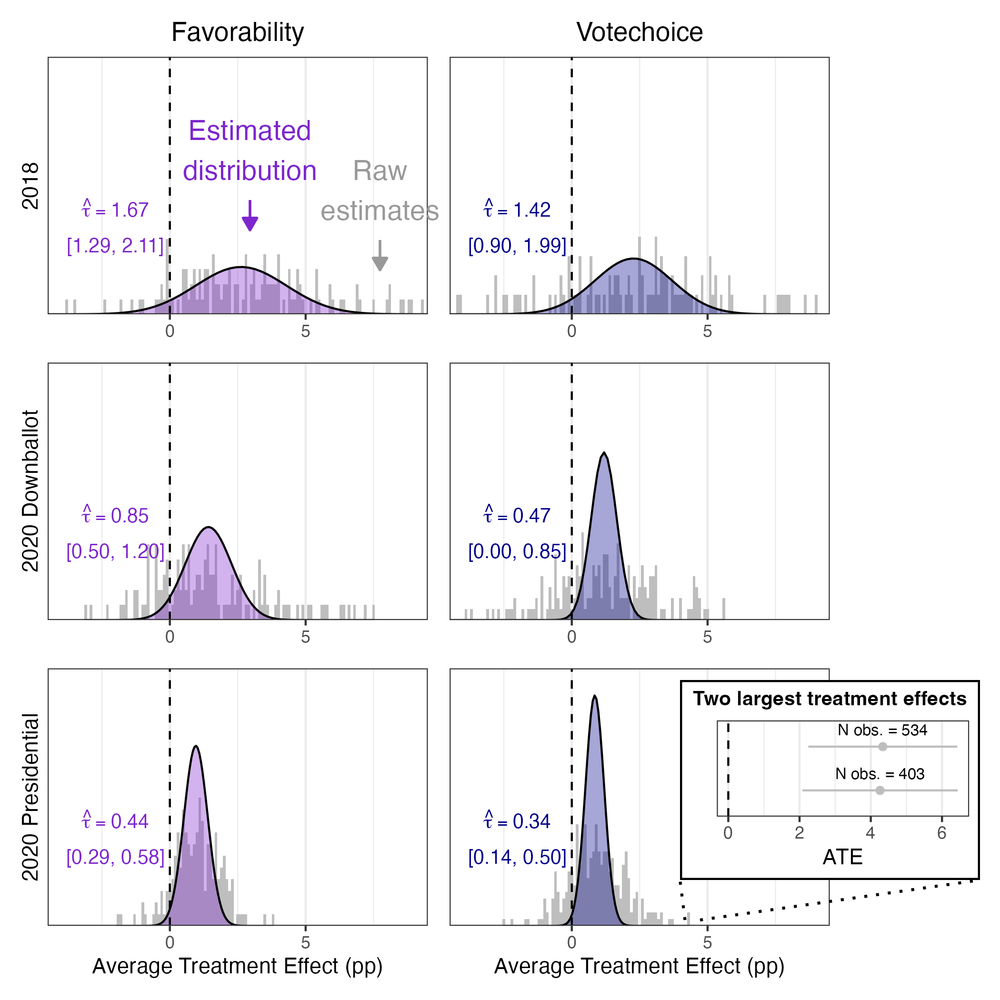

```{r}
#| label: setup
#| include: false
library(tidyverse)
library(here)
library(knitr)
library(kableExtra)
here::i_am("README.qmd")
knitr::opts_chunk$set(echo = FALSE, message = FALSE, warning = FALSE)

latex_out <- knitr::is_latex_output()

# value_paper is a string, always. A column whose entries all look numeric is
# guessed as a double, which turns 0.100 into 0.1 and prints the article back
# wrongly.
ground_truth <- read_csv(
  here::here("ground_truth", "hewitt_etal_2024_ground_truth.csv"),
  col_types = cols(value_paper = col_character(), .default = col_guess())
)
published_claims <- read_csv(
  here::here("ground_truth", "published_claims.csv"),
  col_types = cols(value_paper = col_character(), .default = col_guess())
)
float_coverage <- read_csv(here::here("ground_truth", "float_coverage.csv"),
                           show_col_types = FALSE)
run_status <- read_csv(here::here("ground_truth", "archive_run_status.csv"),
                       show_col_types = FALSE)
overwrites <- read_csv(here::here("ground_truth", "archive_overwrites.csv"),
                       show_col_types = FALSE)
write_calls <- read_csv(here::here("ground_truth", "archive_write_calls.csv"),
                        show_col_types = FALSE)
manifest <- read_csv(here::here("original_manifest.csv"), show_col_types = FALSE)
members <- read_csv(here::here("original_members_manifest.csv"),
                    show_col_types = FALSE)

show_table <- function(d, caption = NULL, align = NULL) {
  k <- kable(d, caption = caption, align = align, booktabs = TRUE,
             format = if (latex_out) "latex" else "pipe", linesep = "")
  if (latex_out) kable_styling(k, latex_options = c("striped", "scale_down")) else k
}

figure <- function(stem) {
  file.path("maintained", "output",
            paste0(stem, if (latex_out) ".pdf" else ".png"))
}

pct <- function(x, y) sprintf("%.1f", 100 * x / y)
```

*Drafted by Claude Opus 5 under the supervision of Alex Coppock.*

This repository reproduces the analysis behind Hewitt et al. (2024), *How Experiments Help Campaigns Persuade Voters: Evidence from a Large Archive of Campaigns' Own Experiments*, and checks every number the article prints against a rewrite of its code in current R.

| | |
|---|---|
| Article | <https://doi.org/10.1017/S0003055423001387> |
| Replication archive | <https://doi.org/10.7910/DVN/LBPSSV> |
| Pre-analysis plan, 2018 data | <https://osf.io/q276a> |
| Pre-analysis plan, 2020 data | <https://osf.io/5c9hx> |
| Errata | [`hewitt_etal_2024_errata.pdf`](hewitt_etal_2024_errata.pdf) |

## What is in this repository

```
download_original.R       fetches and verifies the deposited archive
original_manifest.csv     the deposited container: size and checksums
original_members_manifest.csv  its 186 members
maintained/               the rewrite: one script per published float
maintained/output/        everything the rewrite produces, committed
ground_truth/             the transcription of the article and the comparison
report/                   the rendered PDF of this document
run_all.R                 the entry point
```

The deposited archive is not redistributed here. `download_original.R` fetches it from Harvard Dataverse, checks it against the checksum and byte size the repository publishes, unpacks it, and checks all 186 unpacked members. It stops if `original/` holds anything the manifest does not list, which is what catches an archive that has been run in place.

To reproduce: clone the repository, open `hewitt_etal_2024.Rproj`, and `source("run_all.R")`. The rewrite takes a few minutes. Re-running the deposited archive as a program, which `run_all.R` also does, takes several hours because two of its scripts do; set `ARCHIVE_RUN_SKIP_SLOW=1` to skip those two.

## The article

Political campaigns increasingly test their advertisements before running them. The article analyses the complete archive of `r ground_truth |> filter(claim_id == "abstract_n_experiments") |> pull(value_rewrite)` survey experiments that US campaigns ran through the platform Swayable in 2018 and 2020, covering `r ground_truth |> filter(claim_id == "abstract_n_ads") |> pull(value_rewrite)` advertisements. Because it is the whole archive rather than the published subset of it, publication bias is not a concern.

The analysis has two steps. Each advertisement's average treatment effect on vote choice and on candidate favorability is estimated within its own experiment. Those estimates are then meta-analysed, which separates the variation in the estimates into sampling noise and genuine variation in the underlying effects. The average advertisement moves vote choice by about two percentage points in 2018 and less than one in the 2020 presidential race, and the standard deviation of the true effects is roughly half the average effect in every context. Meta-regressions of the estimates on hand-coded features of the advertisements find almost nothing that predicts persuasiveness consistently across the three electoral contexts.

## The deposited archive

The deposit is a single 257 MB zip holding `r nrow(members)` files: an analysis layer that fits the models, a plotting layer that draws the published floats, and the intermediate objects the first writes and the second reads.

One deposited script cannot run, and the deposit says so: `1_clean_source_data.R` builds the response-level data from Swayable's own files, which the agreement with Swayable does not allow the authors to post. Everything downstream of it is present, including the response-level data it would have produced.

```{r}
#| label: archive-status
run_status |>
  count(pass, outcome) |>
  pivot_wider(names_from = outcome, values_from = n, values_fill = 0) |>
  show_table(caption = "Deposited scripts by pass and outcome.")
```

```{r}
#| label: archive-errors
failures <- run_status |>
  filter(outcome %in% c("error", "timeout")) |>
  select(pass, script, outcome, stopped_at)
if (nrow(failures) > 0) {
  show_table(failures, caption = "Where each deposited script stopped.")
}
```

**As shipped, the deposit reproduces itself.** `2_regressions.R` rebuilds all 1,583 deposited advertisement-level estimates to within 7e-13 of the copies the deposit ships.

**Stripped to data plus code, it produces nothing.** The strip removes every file a deposited script writes, and what the deposit calls its data are themselves derived objects: the response-level file, the study file and the estimates all come out of scripts, and the first of those scripts is the one whose inputs are withheld. The whole chain therefore fails at its first step. That is a fact about the data agreement rather than about the code.

**Running the deposit in place overwrites part of it.** Measured by modification time on a scratch copy, a full run rewrites `r overwrites |> filter(effect == "overwritten") |> nrow()` deposited files and adds `r overwrites |> filter(effect == "added") |> nrow()`. Every overwritten file is in `output/processed_data/`, which is both where the analysis layer writes and part of the deposit. Nothing here is ever run inside `original/` or `original_extracted/`.

The deposit's `r nrow(write_calls)` uncommented write calls are listed in `ground_truth/archive_write_calls.csv`, so the question of whether there is anything to diff against is answered before anything is run rather than after. The scan reads one line at a time, and one deposited write spans two, so `missingness_results.RDS` and `attrition_data.RDS` survive the strip that should have removed them. It makes no difference to the result, because the scripts that read them fail earlier on files the strip did remove.

Six deposited scripts fail as shipped. Two of the six are the environment moving underneath code that was correct when it was written.

| Deposited script | Why it stops |
|---|---|
| `1_clean_source_data.R` | Its inputs are the Swayable source files, which the data agreement does not allow the authors to post. The deposit says so. |
| `4_metaregressions.R` | The time-to-election moderator is built with `I(scale(...))`, which is a one-column matrix, and `if_any()` now requires a logical vector rather than a logical matrix. |
| `randomization_checks/2_missingness.R` | `summarize()` returning more than one row per group is an error from dplyr 1.1; the call needs `reframe()`. |
| `Figure2_distribution.R` | `stat(count)` inside `aes()` is no longer allowed. |
| `appendix_attrition.R` | ggplot2 4.x rejects the labels object the deposit builds. |
| `appendix_sd_simulation.R` | `tidy()` on an `lm_robust` fit with `estimatr` not attached. |

The three plotting failures matter less than they look: the objects those scripts read are all deposited, and the rewrite draws the same floats from them. The two analysis failures matter more, because they mean the deposit as it stands cannot rebuild two of the objects it ships.

Three things about the deposit are worth a reader's attention.

`tau_over_mu_stats.csv` is read by the script that draws Figure 4 and is written by nothing in the deposit. It holds the article's headline parameter, the ratio of the standard deviation of true effects to the average effect, as `r ground_truth |> filter(claim_id == "results_tau_over_mu") |> pull(value_rewrite) |> (\(x) sprintf("%.4f", x))()`. The code that would compute it is present but commented out in `4_metaregressions.R`, which computes a profile of the standard deviation alone instead. The published 0.51 therefore has no derivation anywhere in the deposit, and neither average a reader could form from the article's own printed cells returns it: the six ratios in Table 2 average `r read_csv(here::here("maintained", "output", "text_main_claims.csv"), show_col_types = FALSE) |> filter(quantity == "tau_over_mu_mean_of_six") |> pull(value) |> (\(x) sprintf("%.2f", x))()` and the three vote choice ratios average `r read_csv(here::here("maintained", "output", "text_main_claims.csv"), show_col_types = FALSE) |> filter(quantity == "tau_over_mu_mean_votechoice") |> pull(value) |> (\(x) sprintf("%.2f", x))()`.

Six deposited scripts read a file whose name differs from the deposited name in case: `studies.rds` for `studies.RDS`, `regression_ates.rds` for `regression_ates.RDS`. On macOS this works and on Linux it does not. The rewrite reads the deposited spelling.

The profile-likelihood step in `4_metaregressions.R` runs 501 optimisations for each no-moderator model and its output is used by nothing. It is most of why that script is documented as taking two hours.

## Errata

Five sentences in the article state a number that its own tables contradict, and they are corrected in [`hewitt_etal_2024_errata.pdf`](hewitt_etal_2024_errata.pdf). None of them changes a conclusion. In short: the 2018 standard deviation of true effects on vote choice is 1.4 points rather than 1.5; the range of R-squared values for vote choice ends at 0.39 rather than 0.32; Appendix C.1 quotes Table OA2's 2020 downballot mean as 1.53 where the table gives 1.51; Table 1's last 2020 downballot study is 2020-12-25 rather than 2020-12-22; and the single-rater reliability of the pushiness item is 0.22 rather than 0.23.

Three further findings are recorded here rather than in the errata, because in each case the article does not say clearly enough what it is counting for a correction to be stated.

**The "39 opportunities."** The Results section says "Across the 39 opportunities, we observe just one case in which the coefficient estimates across election types were all statistically significant and had the same sign," and then "In the remaining 38 opportunities, either the sign or the significance of the contrast varied across contexts." The numerator is right: exactly one hypothesis, pushiness on favorability, is significant with the same sign everywhere it was tested. The denominator is not any count Figure 3 supports. The figure has 30 hypothesis rows and two outcome columns, so 60 combinations; 28 of those carry at least one significant cell, 33 of the 166 individual cells are significant, and 46 combinations were tested in all three contexts. None of these is 39, and the article does not define an opportunity, so no corrected figure can be stated.

**The field dates.** The article says the 2018 data were collected "between April 4, 2018 and March 15, 2019" and the 2020 data "between December 7, 2019 and December 24, 2020." The deposit supports two readings and neither matches both endpoints of either sentence.

```{r}
#| label: field-dates
descriptive <- read_csv(here::here("maintained", "output",
                                   "text_descriptive_claims.csv"),
                        show_col_types = FALSE)
descriptive |>
  filter(str_starts(quantity, "field_dates")) |>
  transmute(Claim = quantity, Evidence = evidence) |>
  show_table(caption = "What the deposit says about when the data were collected.")
```

**The number of campaigns.** The abstract says the archive covers advertisements "produced by 51 campaigns." The deposit carries study and advertisement identifiers and no campaign identifier, so the figure cannot be checked at all.

## The extraction and the two instruments

Everything the article and its two appendices print is transcribed before anything is compared, and the transcription is the only place a published number enters this repository.

`ground_truth/published_claims.csv` is the extraction: `r nrow(published_claims)` rows, each one claim, classified by hand. `r sum(published_claims$claim_type == "pipeline")` are `pipeline` claims the analysis should produce, `r sum(published_claims$claim_type == "descriptive")` are `descriptive` claims about shape or count with no printed number, and the rest are design constants, values copied from other articles, and float-level coverage rows.

`ground_truth/published_maintext_tables.csv` and `ground_truth/published_appendix_values.csv` are the positional transcriptions: `r format(sum(float_coverage$published_numbers), big.mark = ",")` published cells read out of the three documents by position rather than in reading order. Three of the article's figures print their numbers on their faces and are read as tables in disguise: Figure 3 and Appendix Figures OA10 and OA12 carry `r float_coverage |> filter(float %in% c("figure_3", "figure_oa10", "figure_oa12")) |> pull(published_numbers) |> sum()` t-statistics between them.

`build_ground_truth.R` joins the two together and writes `ground_truth/hewitt_etal_2024_ground_truth.csv`. It then runs the second instrument as a program: it sources `maintained/in_text_claims.R` into its own environment, captures what it prints, and requires the printed claim ids to be exactly the set the extraction says needs a block. It compares the two instruments value by value, and it checks that the stored `value_paper` string survives a round trip through the precision the extraction records for it. Those three checks were each verified by breaking them: deleting a block trips the count, changing a printed value trips the cross-instrument comparison, and changing a recorded precision trips the round trip, which runs before anything consumes the precision.

`maintained/in_text_claims.R` carries `r sum(published_claims$needs_block)` blocks. Each quotes the sentence verbatim, recomputes its number from `maintained/output/` by its own route, and prints it. It never reads the comparison.

The extraction covers the article and its APSR online appendix sentence by sentence. The Dataverse online appendix is covered at the level of its floats, all `r float_coverage |> filter(str_starts(float, "table_da")) |> pull(published_numbers) |> sum()` cells of them, and not sentence by sentence; that is the boundary of the extraction and it is stated rather than hidden.

## Ground truth

```{r}
#| label: gt-summary
ground_truth |>
  summarize(
    `Rows` = n(),
    `Rewrite matches` = sum(match_rewrite == 1, na.rm = TRUE),
    `Rewrite differs` = sum(match_rewrite == 0, na.rm = TRUE),
    `Descriptive claims holding` = sum(holds, na.rm = TRUE),
    `Descriptive claims failing` = sum(!holds, na.rm = TRUE)
  ) |>
  pivot_longer(everything(), names_to = " ", values_to = "Count") |>
  show_table(caption = "The ground truth in summary.")
```

```{r}
#| label: gt-locus
ground_truth |>
  filter(!is.na(defect_locus)) |>
  count(defect_locus, name = "Rows") |>
  rename(`Where the fault lies` = defect_locus) |>
  show_table(caption = "Every row that is not a clean match carries a locus.")
```

`paper_internal` rows are sentences the article's own tables contradict, and they are the errata. `archive` rows are quantities the deposit was never going to record. `unresolved` rows are the three findings above, where the article does not identify the quantity precisely enough to judge. `rewrite` marks one cosmetic difference in how Figure 2's inset is drawn.

## Float coverage

Every published float that prints a number has a transcription, and the fraction covered is stated rather than assumed.

```{r}
#| label: float-coverage
float_coverage |>
  transmute(
    Float = float,
    `Published numbers` = published_numbers,
    Covered = covered,
    `Reproduced by the rewrite` = reproduced_by_rewrite,
    `Reproduced by the archive` = reproduced_by_archive
  ) |>
  show_table(caption = "Cells reproduced of cells published, per float.")
```

`r format(sum(float_coverage$reproduced_by_rewrite), big.mark = ",")` of the `r format(sum(float_coverage$published_numbers), big.mark = ",")` published cells reproduce, or `r pct(sum(float_coverage$reproduced_by_rewrite), sum(float_coverage$published_numbers))` per cent. The three that do not are the Table 1 date cell corrected in the errata and the two labels of Figure 2's inset, both of whose values are reproduced and only their vertical order is not.

The floats with no row are those that print no numbers: Appendix Figures OA8, OA11, OA13, OA14, OA15 and OA16, and the Dataverse Appendix's feature histograms, correlation matrices and time trends. Figures OA2 through OA7 print a coefficient beside every point; their `r read_csv(here::here("maintained", "output", "figure_oa2_metaregression_coefficients.csv"), show_col_types = FALSE) |> nrow()` values are written to `maintained/output/figure_oa2_metaregression_coefficients.csv` by the script that draws them, and they are the same estimates as the Dataverse Appendix's metaregression tables, which are covered cell by cell.

Tables DA1 through DA3 list all 146 studies individually. The rewrite writes the same study-level table to `maintained/output/table_da1_study_level.csv`, and the three summary rows of Table 1 that aggregate it are covered.

## The maintained rewrite

The rewrite reads the deposit's response-level data and refits everything above it. Two scripts estimate and the rest only draw.

`estimate_ates.R` fits one regression per study and outcome, with the study's assignment clusters where it has them and HC2 otherwise, and recovers all 1,583 deposited estimates to within 7e-13.

`metaregressions.R` fits the meta-analytic models. Every advertisement is a random effect and each study's estimates enter with their full variance-covariance block, since treatments within a study share a placebo group. Compared against the deposit's own saved meta-analysis, `r 3373` quantities agree to within 1.2e-07.

The remaining scripts draw one published float each and write the numbers they plot beside them, so that the comparison never has to be made against a rounded cell.

Substitutions the current environment forced:

| Deposited | Replacement |
|---|---|
| `ggstance::position_dodgev()` | `position_dodge()`, which ggplot2 4.x handles on a discrete axis |
| `stat(count)` inside `aes()` | `after_stat(count)` |
| `annotate(label = bquote(...))` | a parsed plotmath string; ggplot2 4.x rejects a language object as a label |
| `element_rect(size = )` | `element_rect(linewidth = )` |
| `scale_x_continuous(trans = "reverselog")` | a transformation built with `scales::new_transform()` |
| `rm(list = ls())` | omitted |
| `xtable` plus `write()` | `knitr::kable()` and `write_csv()` |
| `library()` in every script | one `helpers.R` |

## Figure verification

Every rendered figure was laid beside the published page. The check is not redundant with the cell comparison: a figure can carry the right numbers on a transposed axis, and only looking catches it.





Figure 1 needed the reversed logarithmic axis rebuilt: the deposit registers the transformation through an interface `scales` no longer offers, and the first rewrite of it drew the right points against axis breaks at 403, 55 and 7 instead of the published 300, 100, 30, 10 and 3. Nothing in the cell comparison could have seen that, because the published labels are axis breaks rather than estimates.

Figure 2 is faithful except for the inset, where the two bars are drawn in the opposite vertical order from the published inset. Both labels are the right values.

## Rewrite verification

`run_all.R` was run to completion twice from clean sessions and the whole of `maintained/output/` was diffed. Every CSV, TeX and PNG came back byte-identical; the figure PDFs differ, because a PDF records the time it was written.

The one stochastic element in the rewrite is the horizontal jitter Figure 1 applies to separate advertisements tested on the same day, which is seeded. Nothing else draws at random: the meta-analytic estimator is deterministic, and the simulation behind Figure 4 is the deposit's, run once and shipped with the archive.

## R environment

```{r}
#| label: session
tibble(
  Component = c("R", "tidyverse", "estimatr", "metafor", "ggplot2", "broom"),
  Version = c(
    paste(R.version$major, R.version$minor, sep = "."),
    as.character(packageVersion("tidyverse")),
    as.character(packageVersion("estimatr")),
    as.character(packageVersion("metafor")),
    as.character(packageVersion("ggplot2")),
    as.character(packageVersion("broom"))
  )
) |>
  show_table(caption = "Versions this reproduction was run against.")
```

The deposited archive is verified against MD5 `r manifest$md5_served` and `r format(manifest$bytes, big.mark = ",")` bytes, which is what Harvard Dataverse serves and what it publishes. A checksum taken after a run of anything that writes a PDF will not match, because a PDF records the time it was written; the checksum above is the deposit's, not the output's.
